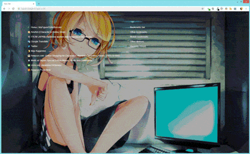

# Random Background Server

[](https://youtu.be/CjPmYSYeTDQ)

This is a **quickly-thrown-together** zero-dependency node server with a single endpoint, /random, which returns a random wallpaper image from a local directory on every request.

The motivation for this is the lack of any Chrome new tab page extension that allows for multiple custom background images from a folder, all of them instead supporting at most one custom image or serving its own lame daily pics of trees and crap.

Now, using [Humble New Tab Page](https://chrome.google.com/webstore/detail/humble-new-tab-page/mfgdmpfihlmdekaclngibpjhdebndhdj) with its background image url pointed at this server, every time I open a new tab I see a different background from my local wallpaper collection:

<p align="center"></p>

Obviously not my work computer. Some custom css is added to apply a dark overlay so text is readable:

<p>
<details>
<summary>NTP custom css</summary>

```css
body::before {
  content: ' ';
  background: rgba(0, 0, 0, 0.33);
  position: fixed;
  top: 0;
  left: 0;
  right: 0;
  bottom: 0;
  z-index: -10000;
  pointer-events: none;
}
```
</details>
</p>

If you want to get real fancy, you can have it so hovering over the options button fades out the overlay and links to reveal the background in all its glory (only applicable to the Humble extension):

<p>
<details>
<summary>Fancier NTP custom css</summary>

```css
/*
Hiding the links requires moving the #options_button above #main:

code $(Get-ChildItem $env:LocalAppData\Google\Chrome\User` Data\Default\Extensions\mfgdmpfihlmdekaclngibpjhdebndhdj\*\newtab.html)
*/

body::-webkit-scrollbar {
  width: 0px;
  background: transparent;
}

#options_button {
  z-index: -10000;
  opacity: 1 !important;
}

#options_button::before {
  content: ' ';
  background: rgba(0, 0, 0, 0.33);
  position: fixed;
  top: 0;
  left: 0;
  right: 0;
  bottom: 0;
  z-index: -10000;
  pointer-events: none;
  transition: opacity 1s ease-in-out;
}

#main {
  transition: opacity 1s;
}

#options_button:hover::before {
  opacity: 0;
  transition: opacity 1s 400ms ease-in-out;
}

#options_button:hover + #main {
  opacity: 0;
  transition: opacity 1s 400ms;
}
```
</details>
</p>

To keep the NTP loading quick, only images up to a certain size are used, and the list of images is cached and refreshed in the background every so often.

## Installing

**Windows:** [Install iisnode](https://github.com/Azure/iisnode) and simply add the repo directory as a site in IIS ([how to enable IIS](https://www.howtogeek.com/112455/how-to-install-iis-8-on-windows-8/)).

**Other:** Set the script up as a service (see [here](https://hackernoon.com/making-node-js-service-always-alive-on-ubuntu-server-e20c9c0808e4) or [here](https://stackoverflow.com/questions/4018154/how-do-i-run-a-node-js-app-as-a-background-service)) or run it via [pm2](https://github.com/Unitech/pm2) or similar.

Run node with `--harmony`. Wallpaper dir set in config.

## Credits

Illustrations shown in above gif:

1. [ネトゲ廃人シュプレヒコール　-Rin.Ver-](https://piapro.jp/t/q6jM) by マクロ
2. [朱](https://www.pixiv.net/member_illust.php?mode=medium&illust_id=54341472) by なつ
3. [Miku & Rin](https://danbooru.donmai.us/posts/2326046) by 豆芽菜
4. [巫女](https://www.pixiv.net/member_illust.php?mode=medium&illust_id=62259051) by 白丝少年(しらいと)
5. [ViR to ReaL](https://www.pixiv.net/member_illust.php?mode=medium&illust_id=44555402) by 雨歌
6. [Miku](https://danbooru.donmai.us/posts/1276525) by DOMO
7. [Mononoke Hime](https://danbooru.donmai.us/posts/1360185) by Erubo
8. [鏡音リンちゃん！](https://www.pixiv.net/member_illust.php?mode=medium&illust_id=20085409) by koshi-kun
9. [すたーだすと](https://www.pixiv.net/member_illust.php?mode=medium&illust_id=16427889) by 真咲
10. [ねぇちゃん](https://www.pixiv.net/member_illust.php?mode=medium&illust_id=40441658) by ま ろ ん
11. [粉雪](https://www.pixiv.net/member_illust.php?mode=medium&illust_id=14401529) by Glamour Audio
12. [红黑！](https://www.pixiv.net/member_illust.php?mode=medium&illust_id=59888608) by NIAN
13. [ソラ](https://www.pixiv.net/member_illust.php?mode=medium&illust_id=47689458) by BEEK
14. [暁の水平線](https://www.pixiv.net/member_illust.php?mode=medium&illust_id=50260737) by たこ焼き
15. [(｡･ω･｡) v](https://www.pixiv.net/member_illust.php?mode=medium&illust_id=48332376) by ☆受菟_ & ALLENES
16. [Saber official art](https://danbooru.donmai.us/posts/1565357) by Takeuchi Takashi
